# vaaski.dev

My personal website. Built with [Nuxt](https://nuxt.com), [shadcn-vue](https://shadcn-vue.com) and [Altcha](https://altcha.org).

  <a href="https://vaaski.dev">
		<!---->
		<!-- dig into how this was made here: -->
		<!-- https://github.com/vaaski/vaaski.dev/blob/2024/components/svg-hero.server.vue -->
		<!---->
		<!-- you can also see the generated version here: -->
		<!-- https://vaaski.dev/static-svg -->
		<!---->
    
  </a>

